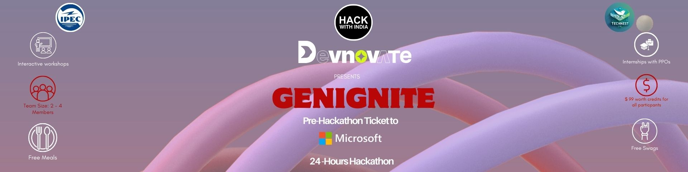

# Strawhats

 

---

## 1. Problem Statement Name

AI-Powered Sports Talent Ecosystem

---

## 2. Problem Statement Description

Most athletes in India, especially from underserved regions, face barriers like lack of access to professional training, gender inequality, financial instability, and biased opportunities. Female athletes remain underrepresented, and many struggle with unreliable funding or resources. These challenges prevent fair talent discovery and growth.

Our solution is an AI-powered sports platform that democratizes access to training, tracks performance scientifically, manages finances securely, and connects athletes with coaches, institutions, and sponsors. By bridging gaps with technology, we aim to build an inclusive, data-driven ecosystem that helps athletes reach their full potential.

---

## 3. Project Overview

Our project is a sports-focused web application designed to support athletes in their training, performance tracking, and career growth. The platform acts as a digital ecosystem where athletes can monitor their progress, access professional guidance, and connect with sports academies and coaches.

The primary goal is to bridge the gap between athletes and resources, ensuring equal opportunities for players across all domains, including underrepresented groups such as women athletes and players from rural areas.

### Key Highlights

* **Web-based Platform:** Easily accessible across devices, removing dependency on mobile-only applications.

* **Athlete Dashboard:** Personalized dashboard showing fitness parameters, progress charts, and achievements.

* **AI Integration:** Smart analytics for performance evaluation and future training recommendations.

* **Sports Academy Access:** Direct connection with academies for admissions, trials, and training opportunities.

* **Inclusivity & Diversity:** Special focus on addressing challenges faced by women athletes and players from remote areas.

* **Scalability:** Can expand into talent scouting, sponsorship opportunities, and global athlete networking.

---

## 4. Architecture

* **Frontend:** React.js, Tailwind.css
* **Backend:** Node.js, Express.js
* **Database:** MongoDB
* **AI Integration:** Python-based AI models for performance prediction & counseling
* **Security:** Authentication, JWT

---

## 5. Tech Stack

* React.js, Tailwind.css
* Node.js, Express.js
* MongoDB
* Python (AI Models)
* RESTful APIs

---

## 6. Team Name

Strawhats

---

## 7. Team Members & Details

| Name                          | Role      | Email                                                 | LinkedIn                                               | College Name |
| ----------------------------- | --------- | ----------------------------------------------------- | ------------------------------------------------------ | ------------ |
| Sonam Jha            | Team Lead | [sonam992007@gmail.com](mailto:sonam992007@gmail.com) | [LinkedIn](https://linkedin.com/in/sonam-kumari-81b768333) |  GLBITM |
| Shreya Khemka            | Member | [shreya.khemka2006@gmail.com](mailto:shreya.khemka2006@gmail.com) | [LinkedIn](https://linkedin.com/in/shreya-khemka-409777380) |  GLBITM |
| Ajay Giri            | Member | [sinexcosecx@gmail.com](mailto:sinexcosecx@gmail.com) | [LinkedIn](https://linkedin.com/in/ajay-giri-8a8604380) |  GLBITM |
| Vatsal Jaiswal            | Member | [vatsaljaiswal17@gmail.com](mailto:vatsaljaiswal17@gmail.com) | [LinkedIn](https://linkedin.com/in/vatsalj17) |  GLBITM |

---

## 8. Additional Links

---

## 9. Instructions for Evaluators

Clone the repository, install dependencies with `npm install`, and run `npm run dev`. Add .env file before running.

---
